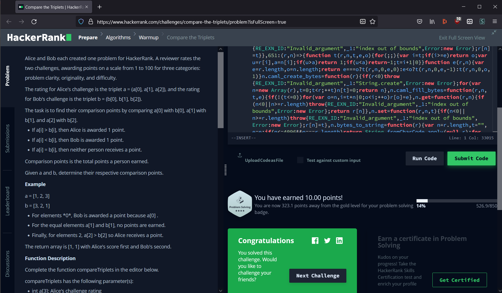

# HackerRank-ReasonML
Project for making it easier to turn ReasonML into JavaScript targeted at HackerRank. Meaning you can:

## Step 1. Write some ReasonML
Write your ReasonML code to solve the problem (this is still a bit hairy for me right now, cleaning things up eventually):
```reasonml
// https://www.hackerrank.com/challenges/a-very-big-sum/problem

Readline.readline(_ => {
  Readline.readline(line2 => {
    line2
    |> Js.String.split(" ")
    |> Js.Array.map(Int64.of_string)
    |> Js.Array.reduce(Int64.add, 0L)
    |> Int64.to_string
    |> Js.log;

    Readline.close();
  });
});
```

## Step 2. Compile and package to JS
This builds all Reason files in the `src` folder, despite the drawbacks which I am hastily ignoring ~~forever~~ for now. The file you specify will then be packaged into `dist/main.js` to be submitted to HackerRank.

It's a bit awkward having to specify a `.bs.js` file, especially if you haven't compiled the code since creating the corresponding `.re` file, need to think of better ways to handle this still.
```sh
$ npm run hackify ./src/AVeryBigSum.bs.js 

> hackerrank-reasonm@0.1.0 prehackify
> npm run build


> hackerrank-reasonm@0.1.0 build
> bsb -make-world

Dependency on @glennsl/bs-jest
Dependency Finished

> hackerrank-reasonm@0.1.0 hackify
> npx webpack build -t "node" --mode production --entry  "./src/AVeryBigSum.bs.js"

asset main.js 20.4 KiB [compared for emit] [minimized] (name: main)
modules by path ./node_modules/bs-platform/lib/js/*.js 52.5 KiB
  ./node_modules/bs-platform/lib/js/int64.js 1.34 KiB [built] [code generated]
  ./node_modules/bs-platform/lib/js/caml_int64.js 12.5 KiB [built] [code generated]
  ./node_modules/bs-platform/lib/js/caml_format.js 19.4 KiB [built] [code generated]
  ./node_modules/bs-platform/lib/js/caml_primitive.js 2.65 KiB [built] [code generated]
  ./node_modules/bs-platform/lib/js/caml_js_exceptions.js 641 bytes [built] [code generated]
  ./node_modules/bs-platform/lib/js/curry.js 11.9 KiB [built] [code generated]
  ./node_modules/bs-platform/lib/js/caml_option.js 1.5 KiB [built] [code generated]
  ./node_modules/bs-platform/lib/js/caml_exceptions.js 492 bytes [built] [code generated]
  ./node_modules/bs-platform/lib/js/caml_array.js 2.17 KiB [built] [code generated]
modules by path ./src/ 1.08 KiB
  ./src/AVeryBigSum.bs.js 629 bytes [built] [code generated]
  ./src/utils/Readline.bs.js 476 bytes [built] [code generated]
external "readline" 42 bytes [built] [code generated]
webpack 5.72.1 compiled successfully in 915 ms
```

### Submit to HackerRank
If everything successfully built and packaged then the output of `dist/main.js` should be ready for HackerRank. Example:


# But doesn't that mean there are answers to hackerrank in here?
Yes, and they're a billion other places online. I'm not here to police other people on how they're using this code, please be responsible and do not use it to cheat. 

TODO: Create a template of this project from an earlier commit, this is my repo to work out of for now.

# VSCode OCaml Platform extension troubleshooting
If you're having any issues with the [OCaml Platform extension](https://github.com/ocamllabs/vscode-ocaml-platform) (used to hook VSCode up to the [`ocaml-lsp-server`](https://github.com/ocaml/ocaml-lsp) for intellisense-y goodness) here are a few things worth trying:

### 1. Version check
You should be running on version 4.06 of the ocaml compiler:
```sh
$ opam switch list
#  switch   compiler                    description
   4.06.1   ocaml-base-compiler.4.06.1  4.06.1
→  4.12.0   ocaml-base-compiler.4.12.0  4.12.0
   4.14.0   ocaml-base-compiler.4.14.0  4.14.0
   default  ocaml-system.4.08.1         default
```

If you have 4.06 available but not active, you can activate it (use your version number):
```sh
$ opam switch 4.06.1
```

If it wasn't installed, install it with:
```sh
$ opam switch create 4.06.1
```

### 2. LSP pre-reqs
Make sure lsp and lspformat (and/or lspformat-rpc) are installed
TODO: rest of this one

### 3. LSP error logs
Check error messages in LSP by enabling them and all that
TODO: rest of this one too